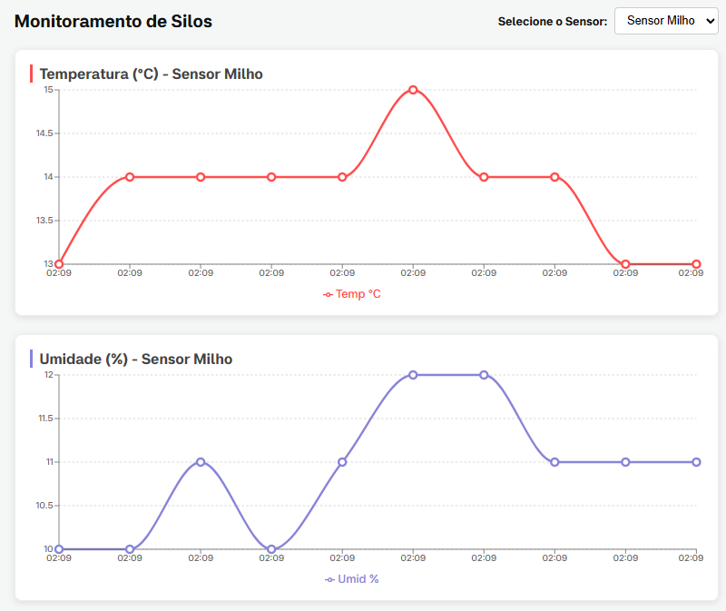

# SiloTech - Sistema de Monitoramento e Gestão

O **SiloTech** é uma plataforma desenvolvida para o monitoramento inteligente de silos agrícolas.  
O sistema permite o cadastro de usuários com validação administrativa, autenticação segura e a visualização em tempo real de dados críticos coletados por sensores.

A solução combina **hardware + software + análise de dados**, ajudando no controle de temperatura e umidade dentro dos silos, reduzindo perdas e melhorando a eficiência no armazenamento de grãos.

---

## Participantes

- Eduardo Schultz de Oliveira  
- Evelyn Maria Mafessoni Thomaz  
- Guilherme Otávio Riffel König  
- Isabela Vitória Fracaro  
- Kaiky Vieira  
- Luiz Eduardo Ramisch Teixeira  
- Samuel Henrique Ramisch Teixeira  

---

## Demonstração



- Dashboard principal  
- Gráficos de sensores  
- Tela de login  
- Alertas em tempo real  

---

## Tecnologias Utilizadas

### Frontend
- React.js
- Vite
- React Router DOM
- Axios
- CSS3

### Backend
- FastAPI
- SQLAlchemy
- Pydantic
- Passlib
- Uvicorn

### Banco de Dados
- SQLite

### Hardware / IoT
- Arduino
- Sensor DHT11
- Comunicação via HTTP com API

---

## Arquitetura do Sistema

- **Frontend (React)** → interface e dashboard
- **Backend (FastAPI)** → API e regras de negócio
- **IoT (Arduino)** → coleta de temperatura e umidade

---

## Segurança

- Senhas criptografadas com Passlib  
- Controle de acesso por papel de usuário (admin/user)  
- Proteção de rotas no frontend  

---

## Funcionalidades

### Usuário comum
- Login
- Visualização de sensores
- Histórico de leituras
- Alertas em tempo real

### Administrador
- Cadastro de usuários
- Visualização de usuários
- Monitoramento completo do sistema

---

## Como rodar o projeto

### Pré-requisitos
- Node.js
- Python 3.10+

---

### Frontend
```bash
npm install
npm run dev
```
### Aplicação disponível em:

http://localhost:5173

### Backend

```bash
cd backend
pip install fastapi uvicorn sqlalchemy passlib[bcrypt] pydantic
python -m uvicorn banco:app --reload
```

### Acesso da API

http://127.0.0.1:8000

---

## Endpoints principais

### Usuários
- POST /cadastro → cria usuário
- POST /login → autenticação

### Sensores
- POST /sensor/leitura → envia leitura do sensor
- GET /sensor/meu-historico/{usuario_id} → histórico de leituras
- GET /sensor/lista-sensores/{usuario_id} → lista sensores do usuário
- GET /sensor/alertas/{usuario_id} → alertas do sistema

---

## Regras do sistema

- Cada usuário pode ter múltiplos sensores
- O sistema mantém apenas as **últimas 12 leituras por sensor**
- Alertas são gerados automaticamente:
  - Temperatura > 20°C ou < 10°C
  - Umidade > 14% ou < 12%


## Melhorias futuras

- Autenticação JWT
- WebSockets para dados em tempo real
- Deploy em nuvem (Render / Railway)
- Dashboard administrativo avançado
- Logs e histórico completo de sensores